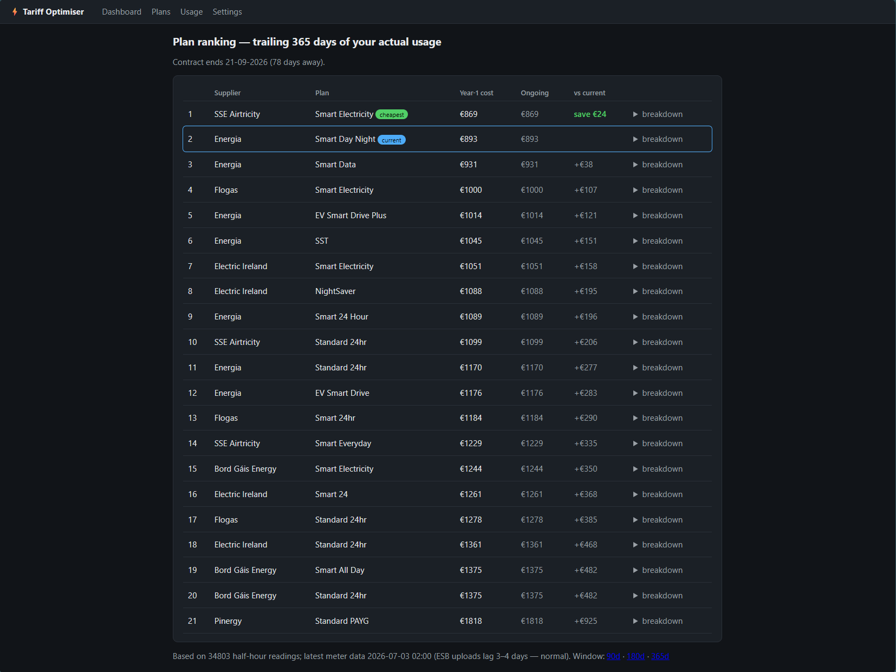
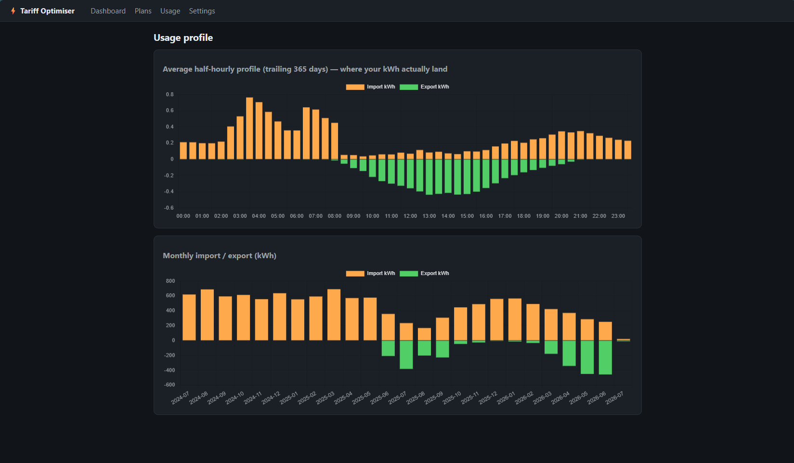
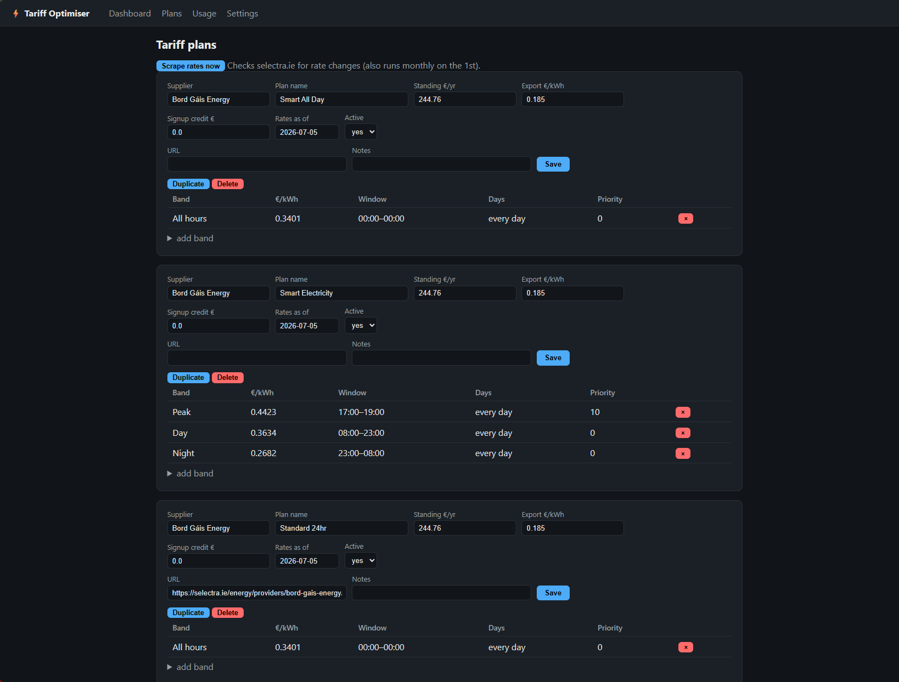
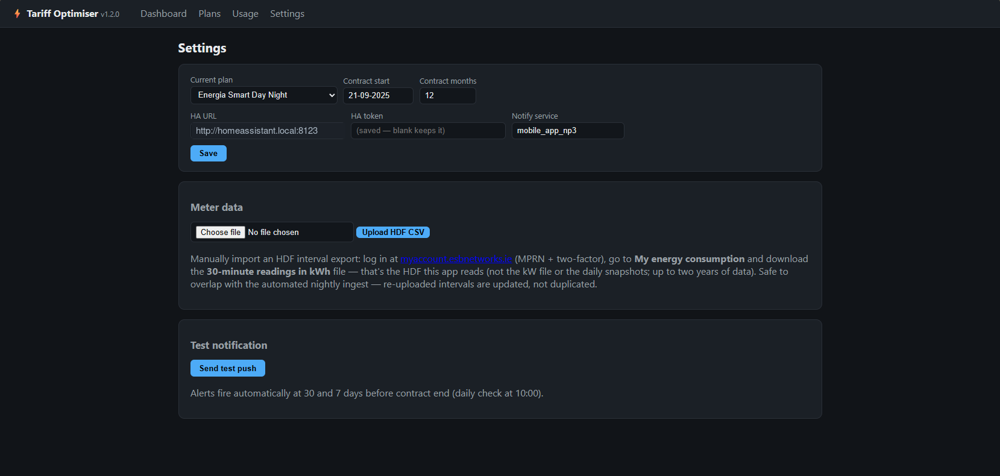

# Irish Tariff Optimiser

Self-hosted app that replays your actual ESB Networks half-hourly smart-meter data against a
library of Irish electricity tariff plans and ranks them by true annual cost — including solar
export credit, standing charges and time-of-use bands (day/night/peak/EV/free windows).

Comparison sites take your annual kWh and apply a "typical" usage profile. But with a smart
meter, solar panels, and time-of-use tariffs, **when** you use electricity matters more than
how much — a plan with a cheap night rate is brilliant for one house and useless for the
next.

**What a comparison site does:** asks for your annual kWh (or guesses), applies a
one-size-fits-all usage curve, ignores your solar export, and prices maybe a dozen
headline offers on the day you visit.

**What this app does:** replays your **actual last 365 days** — all 17,500 half-hour
meter readings — through every plan's real rate bands, credits your export at each
plan's own microgeneration rate, includes standing charges and signup credits, and
re-checks supplier rate cards monthly. The ranking is *your house's* ranking, not an
average household's — and it can honestly tell you that staying put is the best deal,
which no commission-funded comparison site will. It also links with **Home Assistant** to
push a phone notification **30 and 7 days before your current contract expires** — the
ranking lands in front of you exactly when switching is penalty-free.

The **Usage** tab shows where your kWh actually land across the day (the case for a night
tariff at a glance) and monthly import/export; the **Plans** tab manages suppliers, rate bands
and time windows:

The **Settings** tab holds your current plan and contract dates (for the expiry alerts),
the optional Home Assistant connection for notifications, and the manual HDF upload:

## How it works
- A nightly job copies the HDF interval export (`esbn_hdf_latest.csv`) into `data/` and POSTs
  `/api/ingest`. The file comes from [my fork of the esbn-to-mqtt Home Assistant add-on](https://github.com/colfin22/esbn-to-mqtt),
  which saves a local copy of each HDF download (to `/share/esbn/`) alongside publishing the
  MQTT sensors — the stock add-on doesn't keep the file. Any other source of an ESB Networks
  HDF export works too: download it manually from your ESB online account and upload it
  straight from the dashboard.
- The costing engine assigns each half-hour to a plan's rate band by local clock time and
  weekday (interval START time), sums import costs, subtracts export credit, adds the standing
  charge and annualises.
- Plans and their rate bands are managed in the UI (`/plans`); seed data for the six main
  suppliers is in `app/seed.py` with an as-of date — rates are entered including VAT.
- Contract-expiry alerts fire at 30 and 7 days via a Home Assistant notify service (`/settings`).
- A monthly **scrape-and-suggest** job keeps the rates honest — see below.

## Rate scraping

Irish suppliers have no rates API, so `app/scraper.py` checks the per-supplier rate cards on
[selectra.ie](https://selectra.ie/energy/guides/electricity-prices-ireland) (one structured page
per supplier) monthly, and diffs what it finds against your stored plans. Design choices:

- **Suggest, never auto-apply.** Differences are queued as suggestions on the Plans page with
  per-item Apply/Dismiss and an Apply-all. A parsing glitch can't silently corrupt the ranking
  you'll make a switching decision on. Applying a suggestion also bumps the plan's
  "rates as of" date.
- **Fail loudly.** If a page fetch fails or parses to zero plans (layout change), you get a
  Home Assistant notification rather than quietly stale rates — same channel as when it finds
  genuine changes.
- **Sticky dismissals.** A dismissed value won't be re-suggested; a further change to that rate
  will be.
- **What it reads:** urban unit rates per band (converted to include 9% VAT — Selectra quotes
  ex-VAT), standing charge, microgeneration export rate. Plans it sees but you don't track
  surface as informational suggestions.
- **What it can't read:** band *time windows* (peak hours, EV boost windows) aren't published in
  the rate tables — verify those against the supplier's own terms when adding a plan.

Trigger it manually with the **Scrape rates now** button on the Plans page (or
`curl -X POST localhost:8000/api/scrape`), or on a schedule (this
deployment uses a systemd timer on the 1st of the month). Worth knowing: on its very first run
it caught a seeding error in this repo — a rate copied from the rural column instead of urban —
so the review queue earns its keep.

## Run
    docker compose up -d --build

Supplier plans seed themselves on first boot. Then upload your ESB Networks
HDF file on the **Settings** page (or drop it at `data/esbn_hdf_latest.csv`
and `curl -X POST localhost:8000/api/ingest` if you're automating). `/health`
reports readiness — plan count, readings count, newest reading — and tells
you what's missing on a fresh install.

Running outside Docker? Python 3.12+ required (the image handles it for you).
Re-seed plans after editing them: `docker compose exec tariff python -m app.seed --force`.

## Tests
    python -m pytest tests/

## Licence
Built by Colm Finn — [MIT licensed](LICENSE).
